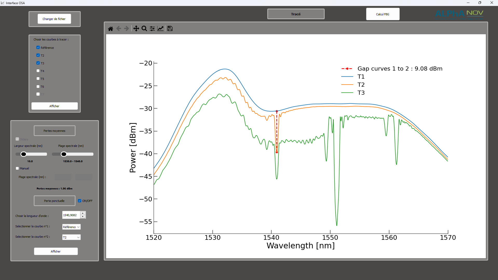

# Interface OSA




# Fonctionnement

Le but de cette interface est de simplifier l'analyse des mesures effectuées par l'OSA. L'Analyseur de Spectre Optique (OSA) retourne un fichier `.csv` brut récupérable sur clé USB qui pourra être sélectionné sur l'interface puis analysé.

Dans un premier temps, l'interface vous invite à selectionner votre fichier `.csv`.
Par la suite, vous pourrez afficher les différentes traces enregistrées par l'OSA (de 0 à 7) et effectuer différentes mesures.

## Mesures

Dans la partie inférieure gauche de l'interface, deux types de mesures peuvent être effectuées.

- Mesures de pertes moyennes
- Mesures de pertes ponctuelles

### Pertes moyennes

A l'aide de sliders ou en rentrant numériquement la plage spectrale de mesure, l'interface mesure les pertes moyennes enregistrées selon deux courbes selectionnées.

### Pertes ponctuelles

Par sélection graphique (en cliquant à l'abscisse voulue sur le graphique) ou numérique de la longueur d'onde, la perte ponctuelle est mesurée et affichée entre les deux courbes selectionnées.

## Autres fonctionnalités

L'interface permet également de mesurer la réflectivité nette (en fonction des paramètres du réseau) dans le menu **Calcul FBG** présent en haut de l'interface.

La modification et la sauveguarde directe du graphique est également disponible à l'aide de la barre d'outils disponible au dessus du graphique.

## Prérequis pour l'installation

- [Python pour macOS](https://www.python.org/downloads/), [Python pour Windows](https://apps.microsoft.com/store/detail/python-310/9PJPW5LDXLZ5)

Avant de télécharger Python, vous pouvez vérifier s'il est déjà installé sur votre ordinateur depuis un terminal. Notez que pour Python, toutes les version de 3.8 à 3.11 seront compatibles. Donc si vous avez déjà l'une de ces versions, inutile d'en installer une autre.

### Windows

Depuis le menu Démarrer, cherchez Powershell et exécuter la commande:

```powershell
python3 --version
```

Ça devrait afficher `Python 3.9.7` avec le numéro de votre version au lieu de `3.9.7`.

Si ça ne fonctionne pas, essayez la commande :

```powershell
python --version
```

Si aucune de ces 2 commandes ne fonctionnent, vous devez télécharger Python depuis le Microsoft Store.


### MacOS

Depuis Finder, cherchez `Terminal`, ouvrez l'application, puis exécutez la commande :

```zsh
python3 --version
```

Ça devrait afficher `Python 3.9.7` avec le numéro de **votre** version au lieu de `3.9.7`.

N'utilisez **jamais** la commande `python` sans le `3` sur MacOS, car il fera référence à Python 2.

## Installation

L'interface nécessite deux fichiers pour fonctionner :

- _interface.py_
- _mplwidget.py_

Vous pourrez trouver ces fichiers dans le dossier **Interface_OSA** de ce dépôt sur GitHub (https://github.com/Kaarton/Projet_Stage). Un troisième fichier _osa.bat_ existe également mais il n'est pas obligatoire pour l'interface graphique. Il permet seulement de lancer le programme en tant qu'application (voir [Installer en tant qu'application](#installer-en-tant-quapplication))

Ces deux fichiers devront être placés dans le même dossier sur votre ordinateur pour que l'interface fonctionne.

## Commandes utile

Exécutez un fichier .py :

```bash
python3 test.py
```

Installez un module externe **Python** :

```bash
pip3 install nom-du-module
```

Sous MacOS, il sera important d'utiliser `pip3` et non pas `pip`.

En effet, le programme permettant d'afficher l'interface graphique utilise des modules Python comme :
- PyQt5
- Matplotlib
- csv
- numpy
- os
- sys

Si ces modules ne sont pas installés, l'interface graphique ne fonctionnera pas. Il faudra donc les installer en utilisant la commande `pip3 install nom-du-module` dans votre terminal :
- Invite de commandes (Windows)
- Terminal (MacOS)


## Choix d'utilisation 

Pour utiliser l'interface graphique, vous pouvez chosir deux méthodes :

- [Lancer l'interface graphique depuis le terminal](#lancer-linterface-graphique) (plus rapide, moins pour les novices)
- [Installer en tant qu'application](#installer-en-tant-quapplication) (plus simple une fois configuré, conseillé)


## Lancer l'interface graphique

Pour lancer l'interface graphique, il suffit d'exécuter le fichier interface.py avec Python. Pour cela, lancer votre terminal sur Windows (en recherchant **Invite de commandes** dans le menu Démarrer) ou sur MacOS (en recherchant **Terminal** dans le Finder). Puis, exécuter la commande suivante  :

```bash
python3 emplacement_du_dossier\interface.py
```

Arrangez vous pour placer les deux fichiers (.py) dans un dossier facile d'accès (style **Bureau/Interface**).
Par exemple, si le fichier _interface.py_ se trouve sur le Bureau dans le dossier **Interface**, il faudra, pour lancer l'interface, effectuer la commande :

```bash
python3 Desktop\Interface\interface.py
```
On peut lancer l'application de différents emplacements mais cela reste plus compliqué à mettre en place pour quelqu'un de novice. Pour plus d'informations, [voir Aide](#aide).

La manière la plus simple est de récupérer le chemin d'accès complet du fichier _interface.py_ et de le copier dans le terminal. Pour cela, vous pouvez vous référer à la section [trouver le chemin d'accès du fichier interface.py](#trouver-le-chemin-daccès-du-fichier-interfacepy).

Lorsque que vous avez copier le chemin d'accès, il suffit de le coller à la suite de `python3` dans le terminal et d'appuyer sur la touche **Entrée**.

<div align="center">
  <p>
    <em><strong>Exemple de code pour lancer l'interface</em></strong>
  </p>
  
</div>

## Installer en tant qu'application

Pour lancer l'interface graphique en tant qu'application, on va demander à l'ordinateur d'éxecuter un script (enchainement de commandes) qui va lancer l'interface graphique. Pour cela, on va utiliser un fichier `.bat` (Windows) qui va contenir le code pour lancer l'interface graphique. Ce fichier `.bat` n'est pas obligé d'être placé dans le même dossier que les fichiers `.py`.

Le fichier `osa.bat` est disponible dans le dossier **Interface_OSA** de ce dépôt sur GitHub (https://github.com/Kaarton/Projet_Stage). Il suffit de le télécharger et de le placer dans le même dossier que les fichiers `.py` ou dans un dossier facile d'accès.

Le fichier `osa.bat` contient trois lignes :

```bash
@echo off
python3 chemin_du_dossier_Interface_OSA\interface.py # exemple : Desktop\Interface_OSA\interface.py
exit
```
La ligne la plus importante est la deuxième. En effet, c'est elle qui va lancer l'interface graphique. Il faut donc la modifier pour qu'elle corresponde à l'emplacement du fichier _interface.py_ sur votre ordinateur.


### Trouver le chemin d'accès du fichier _interface.py_

Pour trouver le chemin d'accès à un fichier, vous pouvez chercher l'emplacement du fichier (ici _interface.py_) sur votre ordinateur, puis effectuer un clic-droit pour se rendre dans le menu **Propriétés**. 


<div align="center">
  <p>
    <em><strong>Menu Propriétés du fichier interface.py</em></strong>
  </p>
  
</div>
<br>


Dans ce menu, vous trouvez un sous menu **Sécurité**. Tout en haut de celui-ci se trouve le chemin d'accès aussi appelé **Nom de l'objet**.

(Retour sur [Lancer l'interface graphique](#lancer-linterface-graphique))

Il vous suffira donc de le copier et de le coller à la place de `chemin_du_dossier_Interface_OSA\interface.py` dans le fichier `osa.bat`.

<div align="center">
  <p>
    <em><strong>Chemin d'accès du fichier interface.py à copier (encadré en rouge)</em></strong>
  </p>
  
</div>
<br>

Enfin, il ne vous reste plus qu'à double-cliquer sur le fichier `.bat` pour lancer l'interface graphique. Si cela fonctionne, c'est que le chemin d'accès est correct et que le fichier `osa.bat` est bien configuré.

Il ne reste pus qu'à faire un raccourci qui pointe vers le fichier `osa.bat` pour pouvoir lancer l'interface graphique depuis le bureau. Pour cela, effectuer un clic droit depuis celui-ci et sélectionner **Nouveau** puis **Raccourci**. Dans la fenêtre qui s'ouvre, cliquer sur **Parcourir** et sélectionner le fichier `.bat` puis cliquer sur **Suivant**. Enfin, donner un nom au raccourci (Interface pour l'OSA par exemple) et cliquer sur **Terminer**.

Enfin, pour ne pas afficher la fenêtre du terminal, pendant l'éxécution du code, vous pouvez la cacher en modifiant les paramètres du raccourci. De la même manière, il faudra se rendre dans les **Propriétés** du raccourci, puis dans l'onglet **Raccourci**. Dans la partie **Exécuter**, sélectionner **Réduite** puis cliquer sur **OK**.

Vous pouvez maintenant lancer l'interface graphique en double-cliquant sur le raccourci.

## Aide

- Pour savoir les éléments présents dans un dossier, on peut utiliser la commande _`dir`_ (Windows) ou _`ls`_ (MacOs).
- Pour se déplacer dans les différents dossiers de votre ordinateur, on peut utiliser la commande _`cd`_ puis le nom du fichier pour s'y rendre :

```bash
cd Interface
```
 Cette méthode permet de se rendre dans des dossiers enfants c'est à dire des dossiers inclus dans le dossier actuel. Ansi, si vous vous situez déjà dans le dossier Bureau, votre terminal affichera :

```bash
 C:\Users\nom\Desktop\Interface
```
Pour remonter d'un dossier en arrière, on peut utiliser la commande _`cd ..`_ . Ainsi, si vous vous situez dans le dossier **Interface**, votre terminal affichera :

```bash
 C:\Users\nom\Desktop
```
Finalement, si vous vous situez dans le dossier **Interface**, il vous suffira d'effectuer la commande :

```bash
python3 interface.py
```
car Python saura que le fichier est dans le dossier courant (dans lequel vous vous situez) et pourra donc l'exécuter.
La ligne écrite sur le terminal sera donc : 

```bash
 C:\Users\nom\Desktop\Interface>python3 interface.py
```

<div align="center">
  <p>
    <em><strong>Exemple du code pour lancer l'interface depuis un dossier quelconque (Interface ici)</em></strong>
  </p>
  
</div>